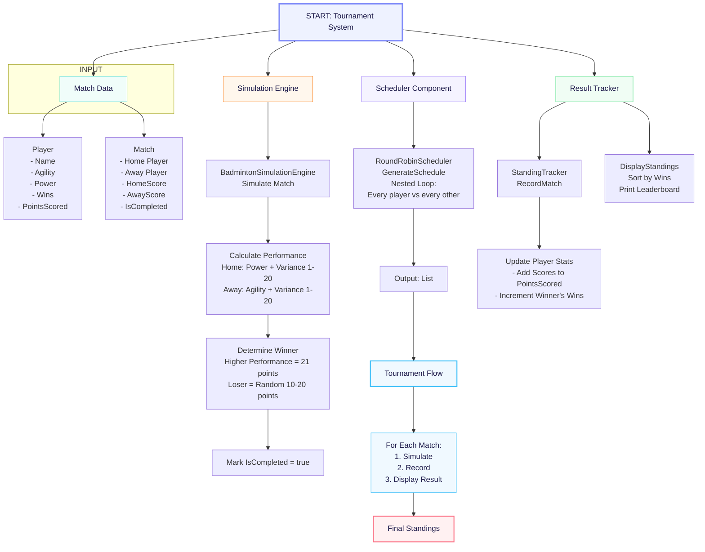
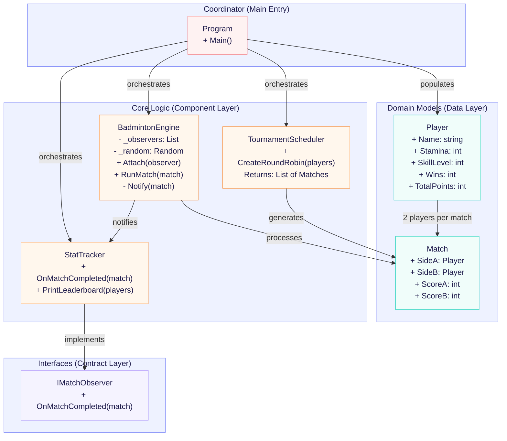

# Badminton-Tournament-Simulator

```mermaid
---
config:
layout: elk
---
graph TD
A["Badminton Tournament Simulator"] --> B["Domain Models"]
A --> C["Scheduler Component"]
A --> D["Simulation Engine"]
A --> E["Result Tracker"]
A[START: Tournament System]

subgraph INPUT
B[Player Data]
B[Match Data]
end
B --> B1["Player
- Name
- Agility
- Power
- Wins
- PointsScored"]
B --> B2["Match
- Home Player
- Away Player
- HomeScore
- AwayScore
- IsCompleted"]

C --> C1["RoundRobinScheduler
GenerateSchedule
Nested Loop:
Every player vs every other"]
C1 --> C2["Output: List<Match>"]

D --> D1["BadmintonSimulationEngine
Simulate Match"]
D1 --> D2["Calculate Performance
Home: Power + Variance 1-20
Away: Agility + Variance 1-20"]
D2 --> D3["Determine Winner
Higher Performance = 21 points
Loser = Random 10-20 points"]
D3 --> D4["Mark IsCompleted = true"]

E --> E1["StandingTracker
RecordMatch"]
E1 --> E2["Update Player Stats
- Add Scores to PointsScored
- Increment Winner's Wins"]
E --> E3["DisplayStandings
Sort by Wins
Print Leaderboard"]

C2 --> F["Tournament Flow"]
F --> G["For Each Match:
1. Simulate
2. Record
3. Display Result"]
G --> H["Final Standings"]

style A stroke:#818cf8,fill:#eef2ff,color:#1e1b4b,stroke-width:3px
style B stroke:#2dd4bf,fill:#f0fdfa,color:#1e1b4b
style C stroke:#a78bfa,fill:#f5f3ff,color:#1e1b4b
style D stroke:#fb923c,fill:#fff7ed,color:#1e1b4b
style E stroke:#4ade80,fill:#f0fdf4,color:#1e1b4b
style F stroke:#38bdf8,fill:#f0f9ff,color:#1e1b4b,stroke-width:2px
style G stroke:#38bdf8,fill:#f0f9ff,color:#1e1b4b
style H stroke:#fb7185,fill:#fff1f2,color:#1e1b4b,stroke-width:2px
```

```mermaid
---


config:
layout: elk
---
graph TB
subgraph interfaces["Interfaces (Contract Layer)"]
IMatchObserver["IMatchObserver
+ OnMatchCompleted(match)"]
end

subgraph models["Domain Models (Data Layer)"]
Player["Player
+ Name: string
+ Stamina: int
+ SkillLevel: int
+ Wins: int
+ TotalPoints: int"]
Match["Match
+ SideA: Player
+ SideB: Player
+ ScoreA: int
+ ScoreB: int"]
end

subgraph components["Core Logic (Component Layer)"]
TournamentScheduler["TournamentScheduler
+ CreateRoundRobin(players)
Returns: List of Matches"]
BadmintonEngine["BadmintonEngine
- _observers: List
- _random: Random
+ Attach(observer)
+ RunMatch(match)
- Notify(match)"]
StatTracker["StatTracker
+ OnMatchCompleted(match)
+ PrintLeaderboard(players)"]
end

subgraph coordinator["Coordinator (Main Entry)"]
Program["Program
+ Main()"]
end

Player -->|"2 players per match"| Match
TournamentScheduler -->|"generates"| Match
BadmintonEngine -->|"processes"| Match
StatTracker -->|"implements"| IMatchObserver
BadmintonEngine -->|"notifies"| StatTracker
Program -->|"orchestrates"| TournamentScheduler
Program -->|"orchestrates"| BadmintonEngine
Program -->|"orchestrates"| StatTracker
Program -->|"populates"| Player

classDef interface stroke:#a78bfa,fill:#f5f3ff,color:#1e1b4b
classDef model stroke:#2dd4bf,fill:#f0fdfa,color:#1e1b4b
classDef component stroke:#fb923c,fill:#fff7ed,color:#1e1b4b
classDef coord stroke:#f87171,fill:#fef2f2,color:#1e1b4b
classDef section stroke:#818cf8,fill:#eef2ff,color:#1e1b4b

class IMatchObserver interface
class Player,Match model
class TournamentScheduler,BadmintonEngine,StatTracker component
class Program coord
class interfaces,models,components,coordinator section
```
