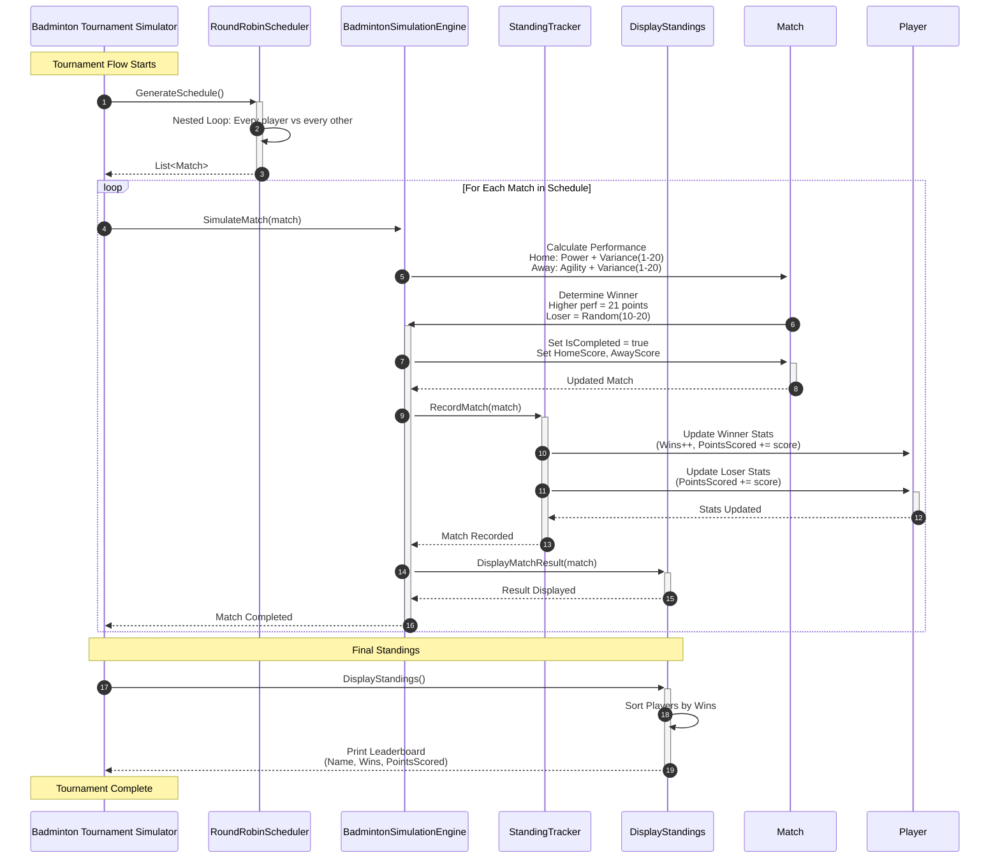

# Badminton-Tournament-Simulator

```mermaid
---


config:
layout: elk
---
graph TB
subgraph interfaces["Interfaces (Contract Layer)"]
IMatchObserver["IMatchObserver
+ OnMatchCompleted(match)"]
end

subgraph models["Domain Models (Data Layer)"]
Player["Player
+ Name: string
+ Stamina: int
+ SkillLevel: int
+ Wins: int
+ TotalPoints: int"]
Match["Match
+ SideA: Player
+ SideB: Player
+ ScoreA: int
+ ScoreB: int"]
end

subgraph components["Core Logic (Component Layer)"]
TournamentScheduler["TournamentScheduler
+ CreateRoundRobin(players)
Returns: List of Matches"]
BadmintonEngine["BadmintonEngine
- _observers: List
- _random: Random
+ Attach(observer)
+ RunMatch(match)
- Notify(match)"]
StatTracker["StatTracker
+ OnMatchCompleted(match)
+ PrintLeaderboard(players)"]
end

subgraph coordinator["Coordinator (Main Entry)"]
Program["Program
+ Main()"]
end

Player -->|"2 players per match"| Match
TournamentScheduler -->|"generates"| Match
BadmintonEngine -->|"processes"| Match
StatTracker -->|"implements"| IMatchObserver
BadmintonEngine -->|"notifies"| StatTracker
Program -->|"orchestrates"| TournamentScheduler
Program -->|"orchestrates"| BadmintonEngine
Program -->|"orchestrates"| StatTracker
Program -->|"populates"| Player

classDef interface stroke:#a78bfa,fill:#f5f3ff,color:#1e1b4b
classDef model stroke:#2dd4bf,fill:#f0fdfa,color:#1e1b4b
classDef component stroke:#fb923c,fill:#fff7ed,color:#1e1b4b
classDef coord stroke:#f87171,fill:#fef2f2,color:#1e1b4b
classDef section stroke:#818cf8,fill:#eef2ff,color:#1e1b4b

class IMatchObserver interface
class Player,Match model
class TournamentScheduler,BadmintonEngine,StatTracker component
class Program coord
class interfaces,models,components,coordinator section
